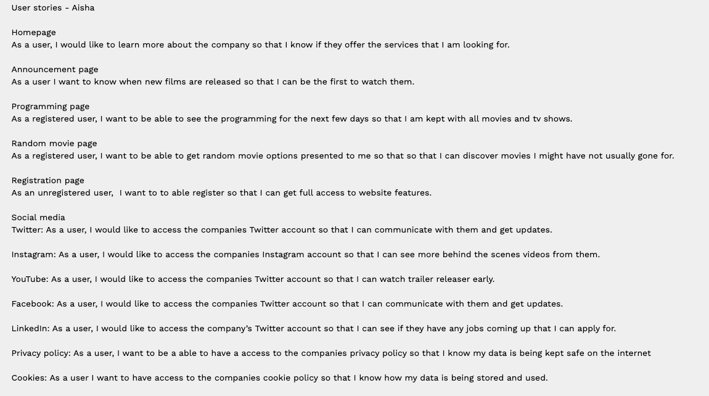
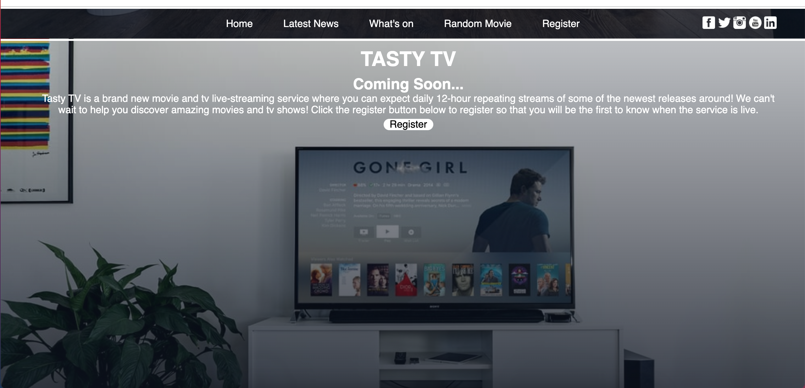
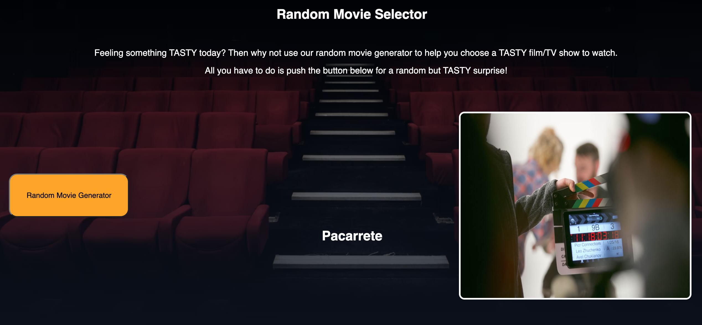
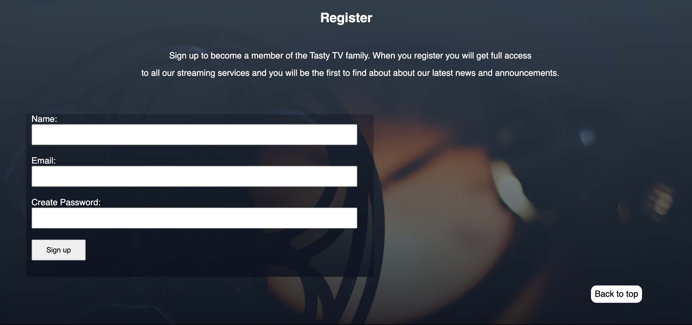
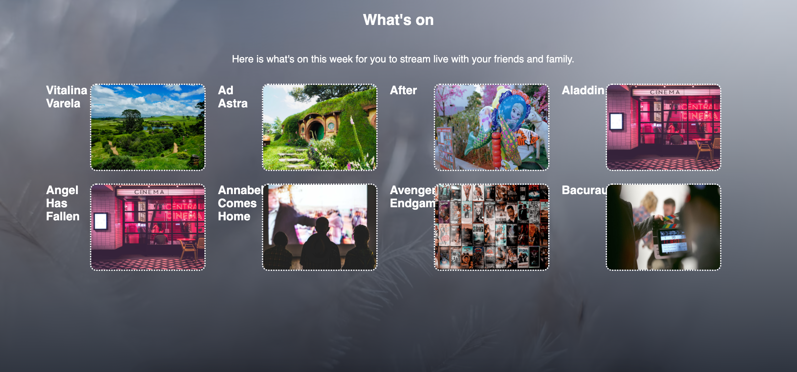
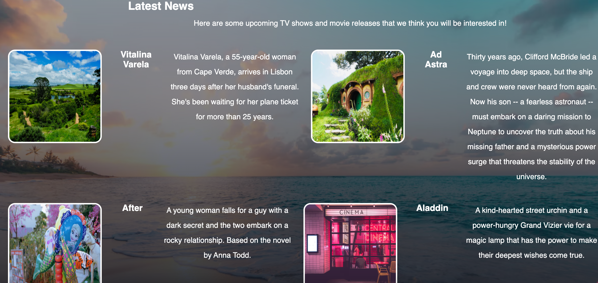

# Tasty TV

## Introduction

An online live-streaming website made using HTML, CSS and JavaScript. I was provided with a 'movies' object which is where I pulled the moveis data from which fed through my website.

## Table of Contents

- Introduction
- Technologies
- Documentation
- Planning, development & problem-solving strategy
- Unsolved problems and future iterations
- Recommendations special feature approach
- Favourite functions & features
- Resources

### Introduction

This is an assignment project that we were set to test our understanding of the platforms that we have learnt on the course so far. It has allowed us to put into pratice everything that we have learned on a real life project. The brief was to build a live streaming website that has a range of features and functionality.

### Technologies

HTML
CSS
JavaScript
Flexbox

### Documentation (links/Wireframes & User stories)

### Planning, development & problem-solving strategy

When we were given the project I read it several times to ensure I understood the key things that were being asked of us. I then broke it doen further by transalting that into what that might look like on paper.

Once that was done, I then started looking at different websites to get an idea of the type of website I wanted to create. I did a Google Image search for modern websites and one thing I noticed most of them had was sections as opposed to pages so I decided to go with that style for my website. I then proceeded to write my wireframe and user stories.

I ran into a few problems along the way where my JavaScript code didn't respond in the way I was expecting and another thing that I found quite fiddly was trying to align images with text boxes. The strategies I had for problem solving were usually, look at MDN and W3 Schools first. If I still needed help then I would do a Google search to see if my problem has already been answered elsewhere and if there was example code that I could use as a guide. Failing that then I would look on YouTube and when I exhausted all avenues and still could solve the probelm I would ask my teacher for help and she would guide me towards where to look to find the problems. Often that would be in the previous class sessions we had done.

### Unsolved problems and future iterations

An unsolved problem that I would need to be fixed in future iterations is the alignment of my images and text in the latest News and What's on sections. I now know that the error I was making was that I did not have all the elements that needed to be grouped together within a div container. I would also work on making the website a lot more responsive. I would also need to underfix the issue of my latest news h3 and p tags not centering. I also ideally need to add a release date for my whats on section to go with the image.

### Recommendations special feature approach

As soon as I saw that section in the brief. I knew it was asking for some sort of random generator and so straight away I knew I would be using Math.Random. I therefore went straight to MDN to refresh my mind on the syntax. I then looked to YouTube to see it being used. There were a few different ways that people used it so I tried to to do it in a way that I best understood and eventually figured it out. It helped that I did some of the other code first too as that made this one fall into place a bit better. At first it was just the image showing so I added functionality so that you could see the name of the random film that was being suggested. I then ran into a problem whereby, each time I clicked on the button, it kept adding to the list of names rather than replacing as the image was doing. From looking at an in class session we did, I knew it was the innerHTML feature that I needed but trying to figure out where I needed to put it took a bit of explaining.

### Favourite functions/features

- Random Film Generator - this uses the Math.floor(Math.random() method which have been assigned to both the arrays image and name value and pull up a different film image with it's corresponding name each time the button is clicked.
- I also like that I was able to make an even better form validation function in JavaScript rather than in html. When a user does not fill in the form properly and tries to submit the form it alerts them with an error message and when filled in properly, they get a confirmatuon message so that they know they have successfully signed up.
- I like the transition hover button feature. I think it just helps to make it look like a really quality well thought through website. When the mouse is hovered over each of the menu items for example, there is a smooth transition then the background turns a different colour.

### Resources

For Website layout inspiration
[GitHub](https://bit.ly/2XzkOGm)
For technical support
[GitHub](https://developer.mozilla.org/en-US/][https://www.w3schools.com/)
[GitHub](https://www.freecodecamp.org/)
[GitHub](https://www.youtube.com/)
